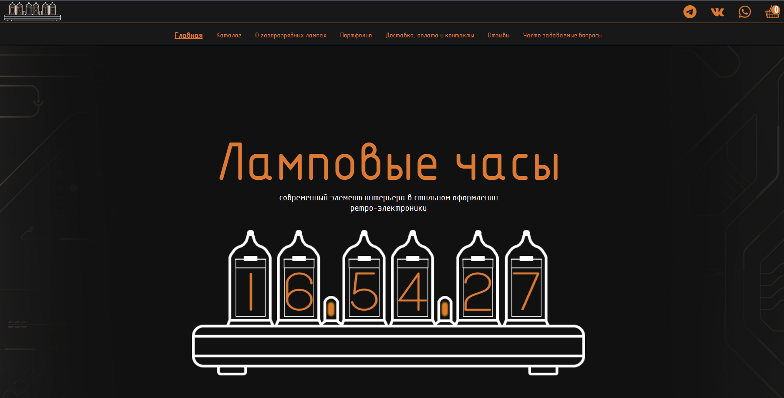
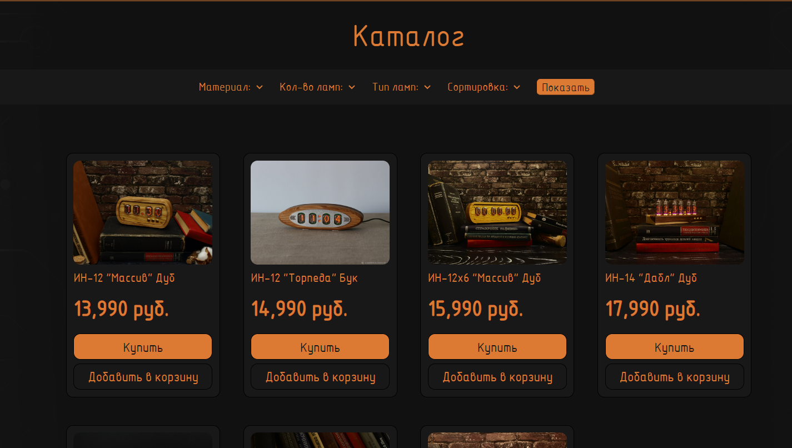

# Nixie site

## Overview

This is a project of an online store selling watches on nixie-indicators.

A full-fledged website of an online store has been created that meets the
requirements of users and is a full-fledged solution for selling goods on the Internet.




## Features

User can:
- View products in the catalog, open product cards, filter products by category
- Add goods into cart
- Place and pay for the order, and then receive a confirmation email
- Ask a question using the form, after which the administrator will receive it by corporate mail
- View additional information on secondary pages of the site

Admin can:
- Add products to the catalog
- View current orders
- Monitor the payment status of orders

## Tech Stack

- **Backend**: Python, Django, Huey, SQLite, Yoomoney API, Redis
- **Frontend**: HTML, CSS, Javascript, Django Template Language

## Installation

1. Clone the repository:

    ```bash
    git clone https://github.com/nsstnc/nixie_site.git
    cd nixie_site
    ```

2. Run the setup script to configure the virtual environment and start the project:

    ```bash
    sh setup.sh  # Use `setup.bat` on Windows
    ```

## Usage

1. After running the setup, the browser page should open automatically. If it does not, open your web browser and navigate to `http://127.0.0.1:1111/`.

## Application Workflow
**User Interaction**:  
    - The user can use the service from both a mobile device and a PC (adaptive layout is implemented).
    - The user selects the products in the catalog and adds them to the cart.
    - The user goes to the shopping cart and starts placing an order.
    - The user goes to the YouMoney page and pays for the order. Before that, he receives an order notification with a link to the payment. At the same time, an order is placed in the admin panel. Next, the Huey task queue simultaneously checks the payment status of the order at certain intervals.


## File Structure
```
nixie_site/  
├── markdown-images/ # Directory for storing documentation images  
├── nixie/ # Main directory app  
    └──  cart/ # An application with the functionality of cart  
    └──  nixie/ # Directory with application settings  
    └──  nixie_app/ # An application with the functionality of main app (it includes templates, static files, main urls and views)  
    └──  order/ # An application with the functionality of creating orders  
    └──  db.sqlite3 # Database  
    └──  manage.py # The program for launching Django application
├── redis/  # Redis directory  
├── README.md # Project documentation  
├── requirements.txt # List of dependencies  
├── setup.bat # Script to set up the virtual environment and start the project for Windows systems  
├── setup.sh # Script to set up the virtual environment and start the project for UNIX systems  
```
